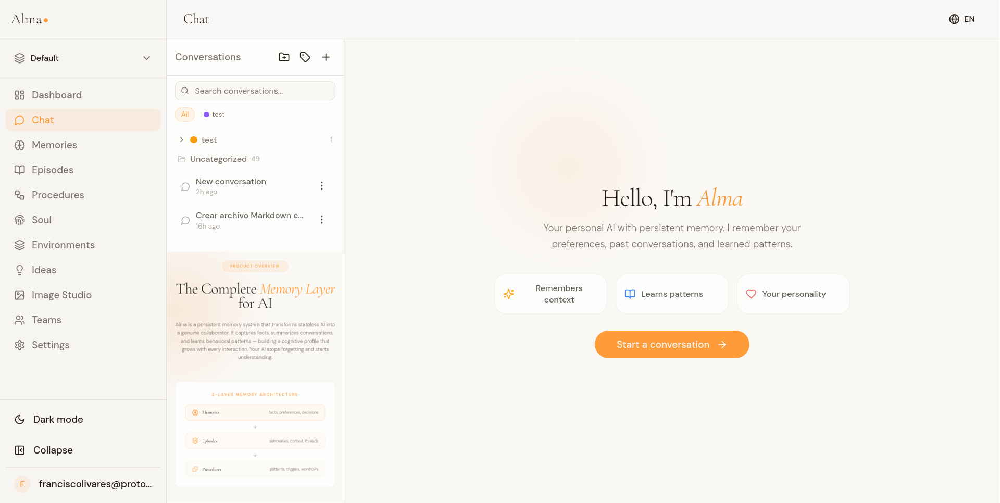
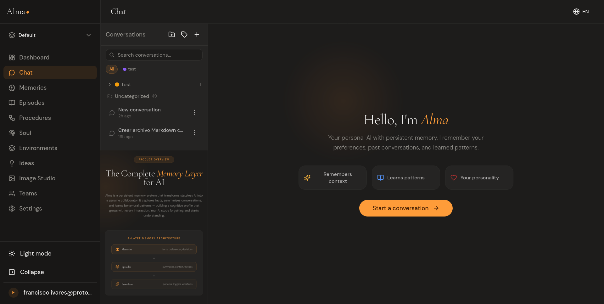

<div align="center">


<br>
<br>

### Persistent Memory for AI

Every AI conversation starts from scratch.
Weeks of context, preferences, decisions — gone the moment you close the tab.

**Alma changes that.**

<br>

[](https://olivares.ai)
[](https://alma.olivares.ai)
[](https://olivares.ai/docs)

</div>

<br>

Alma is a persistent memory layer that captures facts, preferences, decisions, and behavioral patterns from your AI conversations — and makes them available across every session, every tool, every platform.

Day 1 and day 100 no longer feel the same. Your AI stops forgetting. It starts *understanding*.

<br>
<div align="center">
  
  <br><br>
  
</div>

---

<br>

## Why Alma

<table>
<tr>
<td width="50%" valign="top">

**Not just a vector database** — A cognitive system

Vector databases store and retrieve embeddings. Alma understands context at multiple levels — facts, experiences, and behavioral patterns. It doesn't just find similar text; it builds a structured understanding of who you are.

**Not just RAG** — Contextual intelligence

RAG fetches relevant chunks. Alma goes further: it maintains episodic memory, learns procedures over time, and assembles context that includes not just what's relevant, but what's important to *you* specifically.

</td>
<td width="50%" valign="top">

**Not a black box** — Full transparency

Every memory is visible, editable, and deletable. You see exactly what the AI knows about you. Review episode summaries, modify procedures, export your entire cognitive profile. No hidden data, no opaque processes.

**Not locked in** — Your data is yours

Export everything in portable formats at any time. `.alma` bundles, JSON, XLSX, PDF, DOCX, Markdown. Full GDPR-compliant data export. Delete your account and everything goes with it — no retention, no dark patterns.

</td>
</tr>
</table>

<br>

---

<br>

## Three-Layer Memory

Alma organizes knowledge into three complementary layers — mirroring how humans process and retain information.

<table>
<tr>
<td width="33%" valign="top">

### Memories
Discrete facts — preferences, decisions, technical context, personal details. Each memory has a category, importance ranking, and confidence score. Semantically indexed for keyword, embedding, and hybrid search.

```
User prefers TypeScript over JavaScript
Project uses PostgreSQL 16
Prefers concise explanations
```

</td>
<td width="33%" valign="top">

### Episodes
Compressed summaries of past conversations. Episodes capture the arc of a discussion — what was decided, what changed, what matters. No need to replay full transcripts.

```
Debugged auth middleware issue
Designed new database schema
Reviewed API architecture decisions
```

</td>
<td width="33%" valign="top">

### Procedures
Learned behavioral patterns and workflows. Procedures are trigger-action pairs that the AI picks up from observing how you work — from communication style to multi-step processes.

```
When reviewing code → check errors first
Use bullet points for technical topics
Always suggest tests for new functions
```

</td>
</tr>
</table>

<br>

### Soul Engine

All three layers feed into the **Soul Engine** — a structured personality and context framework with 13 configurable blocks organized into three sections:

- **Identity** — who the AI is, its worldview, its principles
- **Style** — communication patterns, anti-patterns, formatting rules
- **Context** — active project awareness, recent learnings, current goals

The Soul Engine assembles the optimal context for every interaction — selecting the most relevant memories, recent episodes, and applicable procedures, then rendering them into a structured system prompt. Four presets (Balanced, Creative, Technical, Mentor) or fully custom configuration. Version history with snapshots and restore.

<br>

---

<br>

## Features

<table>
<tr>
<td width="50%" valign="top">

**Persistent Memory**
Facts, preferences, decisions, and patterns — remembered across every conversation. No more repeating yourself. Day 100 is fundamentally different from day 1.

**Context Assembly**
Hybrid search (keyword + semantic) surfaces the right context for each interaction. Memories, episodes, and procedures assembled in milliseconds within a configurable token budget.

**Background Processing**
Learns while you chat. Memories are extracted, episodes are summarized, and procedures are refined — seamlessly in the background with zero latency impact.

**Smart Deduplication**
Semantic similarity detection prevents redundant memories. When a fact is restated, the existing memory is reinforced instead of duplicated.

**Environments**
Separate memory spaces for different contexts — work, personal, projects. Each environment has its own soul, its own memories, its own knowledge.

</td>
<td width="50%" valign="top">

**Powered by Claude**
Three Anthropic Claude models: Haiku (fast, everyday tasks), Sonnet (balanced quality and speed), and Opus (deep reasoning, complex work). Switch models mid-conversation without losing memory or context continuity.

**Image Studio**
Generate images with Replicate Flux Pro and Leonardo AI. Standalone studio with model selection, style presets, size options, and a full generation history gallery. BYOK supported.

**Voice**
Speech-to-text via Deepgram Nova-2. Text-to-speech via ElevenLabs. Talk to your AI naturally, and it remembers what you said.

**Export Everything**
Conversations to PDF, DOCX, HTML, Markdown. Memories to JSON and XLSX. Full data dumps in the portable `.alma` format with import and deduplication.

**Bring Your Own Keys**
Use your own API keys for Anthropic, Replicate, and Leonardo. BYOK keys are encrypted at rest with AES-256-GCM. Available on Advanced plans and above.

</td>
</tr>
</table>

<br>

---

<br>

## Get Alma

<table>
<tr><th>Platform</th><th>Download</th><th>Best For</th></tr>
<tr>
<td><strong>Web App</strong></td>
<td><a href="https://alma.olivares.ai">alma.olivares.ai</a></td>
<td>Everyone — sign up and chat instantly</td>
</tr>
<tr>
<td><strong>MCP Server</strong></td>
<td><a href="https://www.npmjs.com/package/@olivaresai/alma-mcp"><code>npm i @olivaresai/alma-mcp</code></a></td>
<td>Claude Desktop, Cursor, Windsurf</td>
</tr>
<tr>
<td><strong>VSCode Extension</strong></td>
<td><a href="https://marketplace.visualstudio.com/items?itemName=olivares.alma-vscode">VS Code Marketplace</a></td>
<td>Development workflow</td>
</tr>
<tr>
<td><strong>JavaScript SDK</strong></td>
<td><a href="https://www.npmjs.com/package/@olivaresai/alma-sdk"><code>npm i @olivaresai/alma-sdk</code></a></td>
<td>Node.js / TypeScript integrations</td>
</tr>
<tr>
<td><strong>REST API</strong></td>
<td><a href="https://olivares.ai/developers">Developer Docs</a></td>
<td>Backend integrations (Advanced plan)</td>
</tr>
<tr>
<td><strong>Android</strong></td>
<td>Coming Soon</td>
<td>Mobile — full chat with biometric auth</td>
</tr>
<tr>
<td><strong>iOS</strong></td>
<td>Coming Soon</td>
<td>Mobile — full chat with Face ID</td>
</tr>
</table>

<br>

---

<br>

## Models

**3 chat models** — all from Anthropic Claude, the industry leader in safety and capability.

| Model | Alias | Context | Free | Pro+ |
|-------|-------|---------|:----:|:----:|
| Claude Haiku 4.5 | `claude-haiku` | 200K | Yes | Yes |
| Claude Sonnet 4.6 | `claude-sonnet` | 200K | | Yes |
| Claude Opus 4.6 | `claude-opus` | 200K | | Yes |

**2 image generation providers:**

| Provider | Model | Cost/Image |
|----------|-------|------------|
| Replicate | Flux Pro | $0.04 |
| Leonardo AI | Multiple models | $0.02 |

All AI features consume from a cost-weighted weekly budget. BYOK (Bring Your Own Keys) available on Advanced plans and above.

<br>

---

<br>

## Plans

Start free. Upgrade when you need more.

| | Free | Pro | Advanced | Ultimate | Ultimate Max |
|---|:---:|:---:|:---:|:---:|:---:|
| **Price** | $0 | $19/mo | $49/mo | $149/mo | $249/mo |
| **Memories** | 500 | 10,000 | 50,000 | Unlimited | Unlimited |
| **Episodes** | 50 | Unlimited | Unlimited | Unlimited | Unlimited |
| **Procedures** | 10 | 100 | 500 | Unlimited | Unlimited |
| **Environments** | 1 | 2 | 3 | Unlimited | Unlimited |
| **Chat Models** | Haiku | All 3 | All 3 | All 3 | All 3 |
| **Image Studio** | 1/day | Unlimited | Unlimited | Unlimited | Unlimited |
| **Voice / Day** | 5 min | 60 min | 300 min | No limit | No limit |
| **Web Search / Day** | 5 | 100 | 500 | No limit | No limit |
| **BYOK** | | | Yes | Yes | Yes |
| **API & MCP** | | | Yes | Yes | Yes |
| **Buy Credits** | | Yes | Yes | Yes | Yes |

All AI features (chat, voice, web search, images) consume from a weekly budget that resets automatically. Pro plans and above can purchase additional credit packs that never expire.

[**Compare plans in detail**](https://olivares.ai/pricing)

<br>

---

<br>

## REST API

180+ endpoints covering every aspect of the memory system. All responses are JSON. Streaming chat via SSE. Requires an **Advanced** plan or above.

**Base URL**
```
https://alma.olivares.ai/api/v1/
```

**Authentication** — API key or JWT bearer token:
```bash
# API Key (recommended for scripts and integrations)
curl -H "X-API-Key: alma_sk_..." https://alma.olivares.ai/api/v1/memories

# JWT Bearer (for web applications)
curl -H "Authorization: Bearer eyJ..." https://alma.olivares.ai/api/v1/memories
```

### Endpoints

<details>
<summary><strong>Context Assembly</strong></summary>

```http
POST   /context/assemble         Build the full AI context
POST   /context/continue         Continue an existing conversation context
POST   /context/focus            Update the active context focus
POST   /context/preview          Preview the system prompt the LLM would see
```
</details>

<details>
<summary><strong>Memories</strong></summary>

```http
GET    /memories                 List memories with filters
GET    /memories/search          Search via keyword, semantic, or hybrid
GET    /memories/:id             Get a specific memory
POST   /memories                 Create a memory
PUT    /memories/:id             Update a memory
DELETE /memories/:id             Delete a memory
POST   /memories/extract         AI-powered memory extraction from text
```
</details>

<details>
<summary><strong>Chat</strong></summary>

```http
GET    /chat/models              List available models
GET    /chat/budget              Get current budget status
GET    /chat/usage/history       Usage history
POST   /chat/estimate            Estimate message cost
POST   /chat/conversations       Create a conversation
GET    /chat/conversations       List conversations
GET    /chat/conversations/search  Search conversations
GET    /chat/conversations/:id   Get conversation details
PUT    /chat/conversations/:id   Update conversation
DELETE /chat/conversations/:id   Delete conversation
POST   /chat/conversations/:id/messages  Send message (SSE streaming)
POST   /chat/conversations/:id/retry     Retry last response
```
</details>

<details>
<summary><strong>Episodes</strong></summary>

```http
GET    /episodes                 List episodes
GET    /episodes/search          Search episodes by topic
GET    /episodes/:id             Get a specific episode
POST   /episodes                 Create an episode
PUT    /episodes/:id             Update an episode
DELETE /episodes/:id             Delete an episode
```
</details>

<details>
<summary><strong>Procedures</strong></summary>

```http
GET    /procedures               List procedures
GET    /procedures/:id           Get a specific procedure
POST   /procedures               Create a procedure
POST   /procedures/:id/success   Mark successful execution
PUT    /procedures/:id           Update a procedure
DELETE /procedures/:id           Delete a procedure
```
</details>

<details>
<summary><strong>Soul & Blocks</strong></summary>

```http
GET    /blocks                   List memory blocks
GET    /blocks/:label            Get a specific block
POST   /blocks                   Create a custom block
POST   /blocks/preset            Apply a soul preset
POST   /blocks/init              Reset blocks to defaults
PUT    /blocks/:label            Update a block
DELETE /blocks/:label            Delete a custom block

GET    /soul/versions/list       List soul version history
POST   /soul/versions/snapshot   Create a manual snapshot
GET    /soul/versions/:id        Get a specific version
POST   /soul/versions/:id/restore  Restore to a previous version
```
</details>

<details>
<summary><strong>Image Studio</strong></summary>

```http
POST   /images/generate          Generate an image
GET    /images/history           Image generation history
GET    /images/models            Available image models
```
</details>

<details>
<summary><strong>Voice</strong></summary>

```http
GET    /voice/capabilities       Check available voice features
POST   /voice/transcribe         Voice-to-text (Deepgram Nova-2)
POST   /voice/synthesize         Text-to-speech (ElevenLabs)
```
</details>

<details>
<summary><strong>Environments</strong></summary>

```http
GET    /environments             List environments
POST   /environments             Create an environment
GET    /environments/:id         Get environment details
PUT    /environments/:id         Update an environment
POST   /environments/:id/default Set as default
DELETE /environments/:id         Delete an environment
```
</details>

<details>
<summary><strong>Files</strong></summary>

```http
POST   /files                    Upload a file (image, PDF, text)
GET    /files/:id                Download a file
GET    /files/:id/metadata       File metadata
DELETE /files/:id                Delete a file
```
</details>

<details>
<summary><strong>Ideas</strong></summary>

```http
GET    /ideas                    List ideas and notes
POST   /ideas                    Create an idea
PUT    /ideas/:id                Update an idea
DELETE /ideas/:id                Delete an idea
```
</details>

<details>
<summary><strong>BYOK</strong></summary>

```http
GET    /byok                     List configured providers
PUT    /byok/:provider           Save a provider key (AES-256-GCM encrypted)
GET    /byok/:provider/test      Test a provider key
DELETE /byok/:provider           Remove a provider key
```

Providers: `anthropic`, `replicate`, `leonardo`
</details>

<details>
<summary><strong>Export</strong></summary>

```http
GET    /export/conversation/:id  Export conversation (md, html, pdf, docx)
GET    /export/memories          Export memories (json, md, xlsx)
GET    /export/soul              Export soul configuration (json, md)
GET    /export/all               Full GDPR data export

GET    /admin/export/alma        Full .alma portable export
POST   /admin/import/alma        Import from .alma file with dedup
GET    /admin/insights           Learning dashboard data
```
</details>

<details>
<summary><strong>Auth, Billing, Teams & more</strong></summary>

```http
# Authentication (16 endpoints)
POST   /auth/register, /auth/login, /auth/logout, /auth/logout-all
GET    /auth/me, /auth/sessions, /auth/limits
PUT    /auth/password
DELETE /auth/account

# Two-Factor Authentication
POST   /auth/2fa/enable, /auth/2fa/verify, /auth/2fa/disable

# OAuth
GET    /auth/oauth/google, /auth/oauth/github
GET    /auth/oauth/providers, /auth/oauth/accounts

# API Keys
GET    /auth/api-keys
POST   /auth/api-keys
DELETE /auth/api-keys/:id

# Billing (12 endpoints)
POST   /billing/checkout, /billing/portal, /billing/upgrade, /billing/cancel
GET    /billing/status, /billing/invoices
POST   /billing/credits/purchase
GET    /billing/credits/balance, /billing/credits/history, /billing/credits/packages

# Teams (15+ endpoints)
Full team management: create, invite, roles, billing, environments

# Conversation Folders & Tags
Full CRUD for organizing conversations into folders and tagging systems
```
</details>

<br>

### Quick Example

```bash
# 1. Assemble context for your AI
curl -X POST https://alma.olivares.ai/api/v1/context/assemble \
  -H "X-API-Key: alma_sk_..." \
  -H "Content-Type: application/json" \
  -d '{"maxTokens": 4000}'

# 2. Save a memory
curl -X POST https://alma.olivares.ai/api/v1/memories \
  -H "X-API-Key: alma_sk_..." \
  -H "Content-Type: application/json" \
  -d '{
    "content": "User prefers dark mode and minimal UI",
    "category": "preference",
    "importance": 8
  }'

# 3. Search memories
curl "https://alma.olivares.ai/api/v1/memories/search?q=preferences&mode=hybrid" \
  -H "X-API-Key: alma_sk_..."
```

<br>

---

<br>

## MCP Server

Connect any MCP-compatible AI to Alma's memory layer.

**Install:** [`@olivaresai/alma-mcp`](https://www.npmjs.com/package/@olivaresai/alma-mcp) on npm

```json
{
  "mcpServers": {
    "alma": {
      "command": "npx",
      "args": ["@olivaresai/alma-mcp"],
      "env": { "ALMA_API_KEY": "alma_sk_..." }
    }
  }
}
```

**20 tools** including `get_context`, `search_memories`, `create_memory`, `chat`, `update_block`, `search_episodes`, `create_procedure`, `preview_context`, `export_data`, and more.

**9 resources:** soul, memories, environments, conversations, budget, memories by category, blocks, episodes, procedures.

Compatible with **Claude Desktop**, **Cursor**, **Windsurf**, and any MCP-compatible client.

<br>

---

<br>

## VSCode Extension

**Install:** [`alma-vscode`](https://marketplace.visualstudio.com/items?itemName=olivares.alma-vscode) on the VS Code Marketplace

- **Sidebar chat** with streaming responses and full memory context
- **Memory browser** — search, filter, and manage memories without leaving the IDE
- **Soul block editor** — configure AI personality with presets (Balanced, Creative, Technical, Mentor)
- **Context focus** — Alma automatically knows what file and project you're working on
- **Environment switching** — jump between memory spaces from the command palette
- **Right-click to save** — select any text and save it as a memory
- **Budget display** — remaining AI budget in the status bar

<br>

---

<br>

## JavaScript SDK

Full TypeScript client for the Alma API. ESM, Node.js 18+.

**Install:** [`@olivaresai/alma-sdk`](https://www.npmjs.com/package/@olivaresai/alma-sdk) on npm

```bash
npm install @olivaresai/alma-sdk
```

```typescript
import { AlmaClient } from '@olivaresai/alma-sdk';

const alma = new AlmaClient({ apiKey: 'alma_sk_...' });

// Assemble context for your AI
const context = await alma.context.assemble({ maxTokens: 4000 });

// Save a memory
await alma.memories.create({
  content: 'User prefers TypeScript',
  category: 'preference',
  importance: 8
});

// Search memories
const results = await alma.memories.search({ q: 'preferences', mode: 'hybrid' });

// Stream a chat message
await alma.chat.sendMessage(conversationId, {
  content: 'Hello',
  onToken: (token) => process.stdout.write(token)
});
```

<br>

---

<br>

## Mobile Apps

Native iOS and Android apps built with Capacitor 7. Full chat experience with biometric authentication, push notifications, and offline-ready architecture.

| Platform | Status | Auth |
|----------|--------|------|
| **Android** | Coming Soon | Biometric (Fingerprint) |
| **iOS** | Coming Soon | Face ID / Touch ID |

Both apps connect to the same Alma backend — your memories, conversations, and soul persist seamlessly between web, mobile, and extensions.

<br>

---

<br>

## Agent Tools

When chatting with Alma, the AI has access to 6 specialized tools that extend its capabilities beyond conversation:

| Tool | Description |
|------|-------------|
| `update_memory_block` | Edit soul blocks — worldview, style guide, user profile, learned patterns |
| `search_memories` | Semantic search across long-term memory |
| `search_conversations` | Search past conversation episodes |
| `save_memory` | Save new facts to long-term memory |
| `web_search` | Search the web (Brave + Tavily) |
| `create_document` | Generate downloadable files (DOCX, XLSX, PPTX) |

Tools execute transparently — you see exactly what the AI is doing, in real time, with full streaming feedback.

<br>

---

<br>

## Internationalization

Alma speaks your language. 15 fully localized languages across the entire interface:

Arabic, Chinese, Dutch, English, French, German, Hindi, Italian, Japanese, Korean, Portuguese, Russian, Spanish, Turkish, Ukrainian

<br>

---

<br>

## Security & Privacy

Your cognitive data is the most personal data there is. We treat it that way.

- **Encryption** — All data encrypted at rest and in transit. BYOK keys use AES-256-GCM with per-record key derivation
- **Authentication** — Passwords hashed with PBKDF2-SHA512 (100K iterations). API keys hashed with HMAC-SHA256. JWT sessions with httpOnly cookies
- **2FA** — TOTP-based two-factor authentication with recovery codes
- **OAuth** — Sign in with Google or GitHub
- **CSRF Protection** — Origin validation on all state-changing requests
- **Rate Limiting** — Per-minute and per-day limits with IP-based lockout protection
- **Isolation** — Memories are isolated per account and per environment
- **No tracking** — No tracking cookies, no third-party analytics, no data selling
- **GDPR** — Full data export and deletion at any time. No retention after deletion
- **Transparency** — Every memory, episode, and procedure is visible and inspectable
- **Audited** — 11 comprehensive security audits since launch, Swiss-grade quality principles

If you downgrade or cancel, your data is never deleted automatically. You maintain read access to everything you've built.

<br>

---

<br>

## Infrastructure

Built on Cloudflare's global edge network for speed, reliability, and data sovereignty.

| Component | Technology |
|-----------|-----------|
| **API** | Cloudflare Workers (Hono) |
| **Database** | Cloudflare D1 (SQLite) — 56 migrations |
| **Vector Search** | Cloudflare Vectorize (2 indexes) |
| **File Storage** | Cloudflare R2 |
| **Caching** | Cloudflare KV |
| **Budget Coordination** | Cloudflare Durable Objects |
| **Frontend** | React 19 + Vite 6 on Cloudflare Pages |
| **Background Jobs** | Cloudflare Queues with DLQ |

<br>

---

<br>

## Report Issues

Found a bug? Have a feature request? We welcome your feedback.

- [**Open an issue**](https://github.com/olivaresai/alma/issues/new) — Bug reports and feature requests
- [**Discussions**](https://github.com/olivaresai/alma/discussions) — Questions, ideas, and community

When reporting an issue, please include:
- What you expected vs. what happened
- Steps to reproduce (if applicable)
- Plan tier and client (web app, VSCode, MCP, API)

<br>

---

<br>

## Links

| | |
|---|---|
| **Website** | [olivares.ai](https://olivares.ai) |
| **App** | [alma.olivares.ai](https://alma.olivares.ai) |
| **Documentation** | [olivares.ai/docs](https://olivares.ai/docs) |
| **API Reference** | [olivares.ai/developers](https://olivares.ai/developers) |
| **Philosophy** | [olivares.ai/philosophy](https://olivares.ai/philosophy) |
| **SDK** | [@olivaresai/alma-sdk](https://www.npmjs.com/package/@olivaresai/alma-sdk) |
| **MCP** | [@olivaresai/alma-mcp](https://www.npmjs.com/package/@olivaresai/alma-mcp) |
| **VSCode** | [alma-vscode](https://marketplace.visualstudio.com/items?itemName=olivares.alma-vscode) |
| **Types** | [@olivaresai/alma-types](https://www.npmjs.com/package/@olivaresai/alma-types) |
| **Privacy** | [olivares.ai/privacy](https://olivares.ai/privacy) |
| **Terms** | [olivares.ai/terms](https://olivares.ai/terms) |
| **Contact** | hello@olivares.ai |

<br>

---

<div align="center">

<br>

Alma is proprietary software. All rights reserved.
This repository serves as public documentation and a point of contact for issue reporting.

<br>

*Built by [olivares.ai](https://olivares.ai)*

*Give your AI a soul.*

</div>
